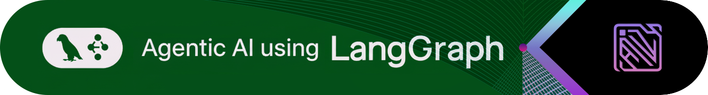
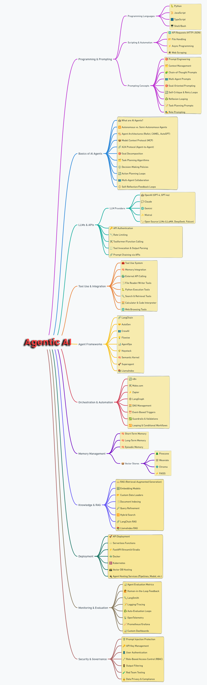
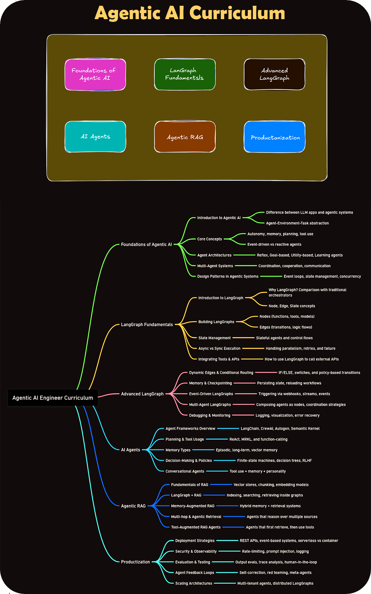

<div align="center">
  

  <h1>Agentic AI with LangGraph</h1>
  
  <p>
    <b>Build autonomous, stateful, and goal-oriented AI systems capable of complex multi-step reasoning.</b>
  </p>

  <!-- Badges -->
  <p>
    <a href="https://github.com/mohd-faizy/Agentic_AI_using_LangGraph/blob/main/LICENSE">
      
    </a>
    
    
    
    
  </p>

  <br />
</div>

---

## 📖 Overview

This repository demonstrates the comprehensive implementation of **Agentic AI** systems using **LangGraph**. Unlike traditional stateless Generative AI, this framework enables the creation of **autonomous agents** that can plan, execute, remember context, and collaborate to solve complex tasks.

It serves as both a **learning curriculum** and a **reference implementation** for building production-ready agentic workflows, covering everything from basic sequential chains to complex multi-agent orchestration with the **Model Context Protocol (MCP)**.

### 🧬 What is AgenticAI?

AgenticAI describes systems defined by:
*   **Autonomy**: Agents independently plan and execute subtasks.
*   **Orchestration**: Workflows are coordinated via a shared protocol (MCP).
*   **Composability**: Agents and graphs are modular, reusable, and testable.

---

## 🛣️ Roadmap & Curriculum

<div align="center">
  
</div>

### 🎓 Learning Path
*   **Foundation Level**
    *   ***Foundations of Agentic AI***: Core concepts and principles
    *   ***LangGraph Fundamentals***: State machines and workflow design
*   **Intermediate Level**
    *   ***Advanced LangGraph***: Complex routing and error handling
    *   ***AI Agents***: Agent design patterns and architectures
*   **Advanced Level**
    *   ***Agentic RAG***: Retrieval-augmented generation with agents
    *   ***Production Deployment***: Scaling and monitoring strategies

<div align="center">
  
</div>

---

## 🛠️ Core Components

The system is built around these modular and interoperable components:

1.  **Agents**
    *   *Description:* Autonomous entities with specific roles, memory, tools, and objectives.
    *   *Examples:* `PlannerAgent` (decomposes goals), `ResearchAgent` (gathers data), `ExecutionAgent` (runs tasks).

2.  **LangGraph State Machine**
    *   *Description:* The central orchestrator defining agent transitions, execution flow, and dynamic task routing.
    *   *Key Features:* Warning-Stateful DAG, Conditional Routing, Concurrency & Retries.

3.  **MCP Message Layer**
    *   *Description:* Protocol for structured message exchange including `Message`, `Thread`, `Step`, and `Run` objects to trace agent reasoning.

4.  **Memory and Context Store**
    *   *Description:* Long-term and short-term memory (Thread-level history, Agent-specific context, Vector DBs for RAG).

5.  **Tools and Interfaces**
    *   *Description:* External capabilities (Web search, Code interpreter, API clients) abstracted as callable nodes.

6.  **Task Router / Controller**
    *   *Description:* Mechanism for Centralized Planning or Distributed Negotiation to assign subtasks.

7.  **Observability & Debugging**
    *   *Description:* Logging, tracing, and monitoring via LangGraph visualizer and logging middleware.

---

## ⚖️ GenAI vs AgenticAI

| Feature | Generative AI (GenAI) | Agentic AI |
| :--- | :--- | :--- |
| **Primary Output** | Unstructured content (text, image, audio) | Structured outputs from autonomous task execution |
| **Execution Flow** | Stateless, single-step inference | Stateful, iterative multi-step reasoning with memory |
| **Architecture** | Monolithic linear pipelines | Modular, event-driven multi-agent systems (DAGs) |
| **Decision-Making** | Prompt-conditioned output | Goal-oriented planning & dynamic context tracking |
| **Autonomy** | Passive response to queries | Proactive decision-making |
| **Control Flow** | Prompt engineering | Finite-state machines & reactive policies |
| **Memory** | Ephemeral (limited context) | Persistent, structured memory |
| **Tool Use** | Manually scripted / templates | Dynamic tool selection via MCP |
| **Scalability** | Limited by model/context size | Horizontal scaling via specialized agents |
| **Debuggability** | Opaque reasoning | Transparent workflows & traceable nodes |

---

## 📂 Project Structure

```bash
Agentic_AI_using_LangGraph/
├── 01_Foundation_of_AgenticAI/       # Basic concepts and functional nodes
├── 02_Sequential_&_Parallel_workflow/# Linear and parallel chain executions
├── 03_Conditional_Workflow/          # Dynamic routing based on logic (Router)
├── 04_Iterative_Workflows/           # Loops and retry mechanisms
├── 05_Structured_ai_chatbot/         # Schema-driven agent responses
├── 06_Conversational_ai_chatbot/     # Advanced chatbots with memory
├── 07_LangsSmith/                    # Tracing and observability setup
├── _img/                             # Assets and diagrams
├── main.py                           # Entry point for testing
└── requirements.txt                  # Project dependencies
```

---

## 🚀 Getting Started

### Prerequisites
*   **Python 3.9+**
*   **Git**
*   **API Keys**: OpenAI, Anthropic, or HuggingFace.

### Installation

We recommend using `uv` for fast dependency management, but standard `pip` works as well.

1.  **Clone the repository**
    ```bash
    git clone https://github.com/mohd-faizy/Agentic_AI_using_LangGraph.git
    cd Agentic_AI_using_LangGraph
    ```

2.  **Set up the environment**

    *Using `uv` (Recommended):*
    ```bash
    uv venv
    source .venv/bin/activate       # macOS/Linux
    .venv\Scripts\activate          # Windows
    uv add -r requirements.txt
    ```

    *Using `pip`:*
    ```bash
    python -m venv venv
    source venv/bin/activate        # macOS/Linux
    venv\Scripts\activate           # Windows
    pip install -r requirements.txt
    ```

3.  **Configuration**
    Create a `.env` file:
    ```bash
    cp .env.example .env
    ```
    Add your keys:
    ```ini
    OPENAI_API_KEY=sk-...
    LANGCHAIN_API_KEY=...
    ```

## ⚡ Quick Start

```python
from langgraph.graph import StateGraph, END
from typing import TypedDict

# 1. Define State
class AgentState(TypedDict):
    messages: list

# 2. Define Nodes
def agent_node(state: AgentState):
    return {"messages": ["Agent processing..."]}

# 3. Build Graph
workflow = StateGraph(AgentState)
workflow.add_node("agent", agent_node)
workflow.set_entry_point("agent")
workflow.add_edge("agent", END)

# 4. Compile & Run
app = workflow.compile()
print(app.invoke({"messages": ["Init"]}))
```

---

## 🤝 Contributing & Support

Contributions are welcome! If you find this repository helpful, please **star** it!

<div align="center">
  <br>
  <p><b>Connect with me</b></p>
  <a href="https://twitter.com/F4izy"></a>
  <a href="https://www.linkedin.com/in/mohd-faizy/"></a>
  <a href="https://github.com/mohd-faizy"></a>
</div>

## 📄 License

Distributed under the MIT License. See `LICENSE` for more information.
