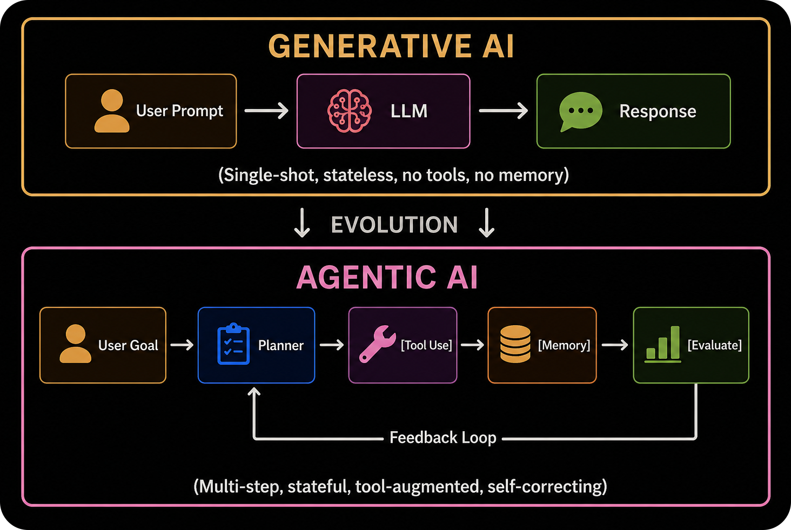
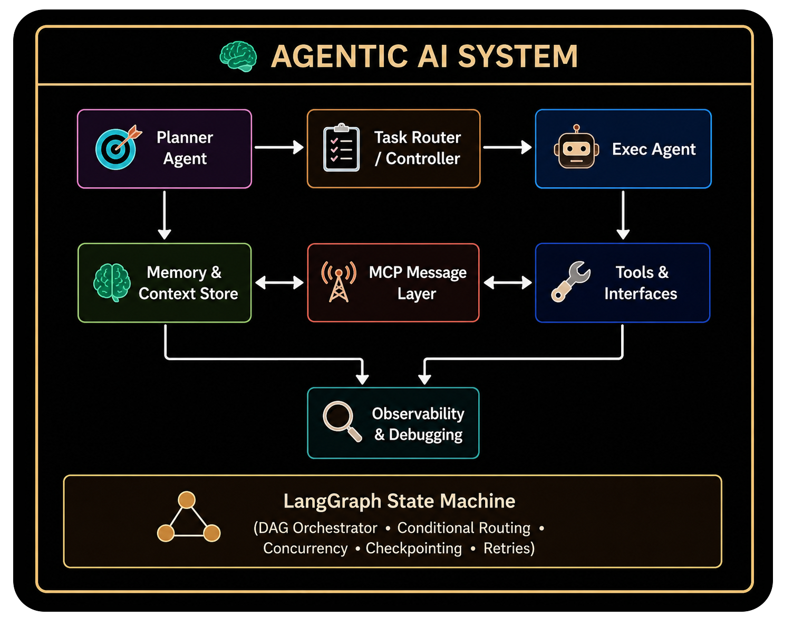
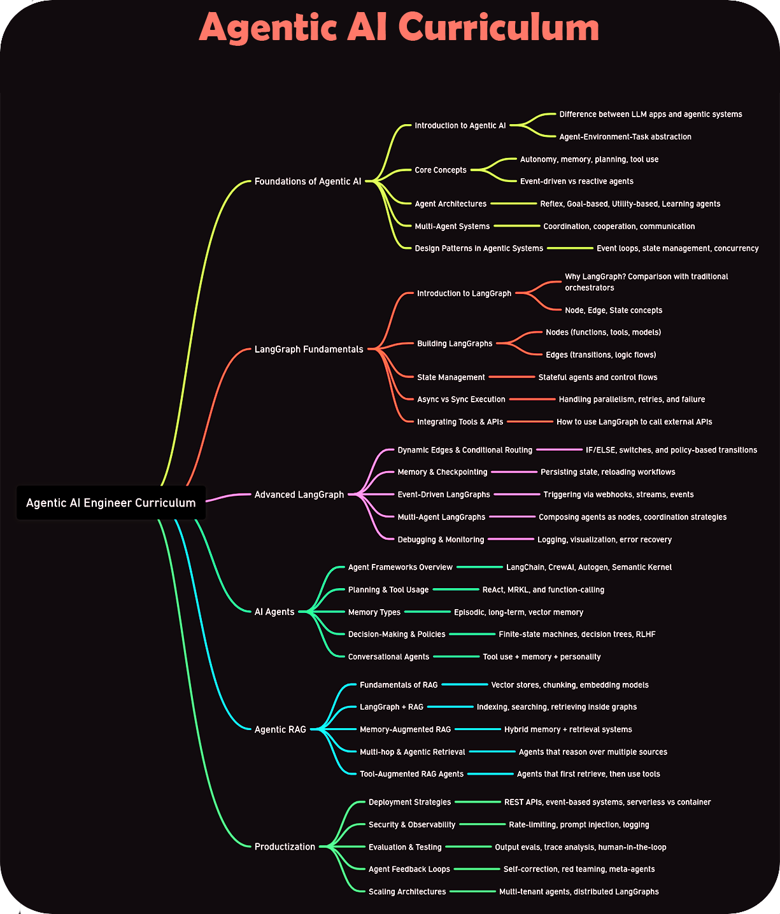
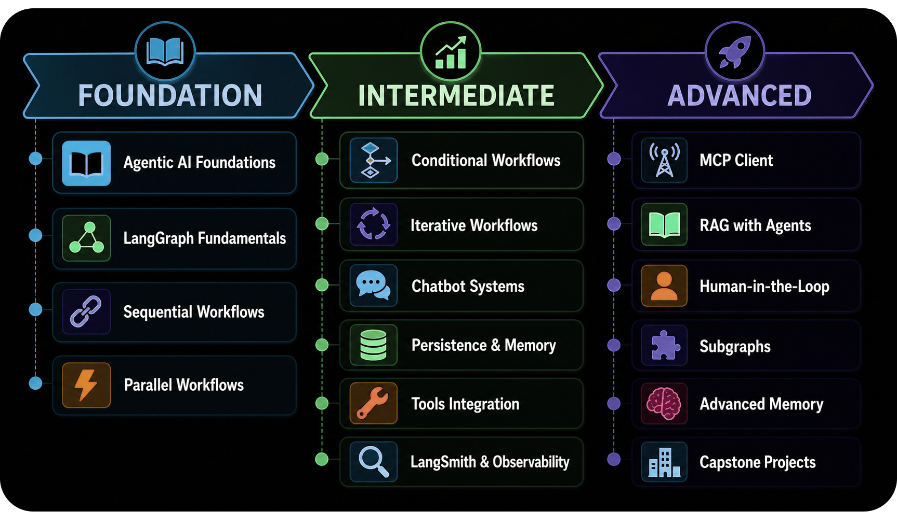

<div align="center">

  <!-- Hero Banner -->
  

  <br/>

  <h1>🧠 Agentic AI with LangGraph</h1>

  <h3>
    Build autonomous, stateful, and goal-oriented AI systems<br/>
    capable of complex multi-step reasoning & real-world action.
  </h3>

  <br/>

  <!-- Quick Stats -->
  <p>
    <a href="https://github.com/mohd-faizy/Agentic_AI_using_LangGraph/stargazers">
      
    </a>
    <a href="https://github.com/mohd-faizy/Agentic_AI_using_LangGraph/network/members">
      
    </a>
    <a href="https://github.com/mohd-faizy/Agentic_AI_using_LangGraph/issues">
      
    </a>
    <a href="https://github.com/mohd-faizy/Agentic_AI_using_LangGraph/blob/main/LICENSE">
      
    </a>
    <a href="https://github.com/mohd-faizy/Agentic_AI_using_LangGraph">
      
    </a>
  </p>

  <!-- Tech Badges -->
  <p>
    
    
    
    
    
    
    
    
    
    
    
  </p>

  <br/>

  <p>
    <a href="#-quick-start"><b>Quick Start</b></a> · 
    <a href="#-notebook-index"><b>Notebooks</b></a> · 
    <a href="#-architecture"><b>Architecture</b></a> · 
    <a href="#-roadmap--curriculum"><b>Roadmap</b></a> · 
    <a href="#-contributing"><b>Contributing</b></a>
  </p>

  <br/>
</div>

---

## 🔍 What is This?

> **A comprehensive, hands-on curriculum for mastering Agentic AI** — from foundational concepts to production-grade multi-agent orchestration — all built on top of [LangGraph](https://langchain-ai.github.io/langgraph/).


## 🧬 GenAI vs Agentic AI — Why Agents?

Understanding the paradigm shift from passive generation to active reasoning:

<div align="center">
  
</div>


| Dimension | Generative AI | Agentic AI |
|:---|:---|:---|
| **Execution** | Single-shot inference | Multi-step iterative reasoning |
| **State** | Stateless / ephemeral context | Persistent, structured memory |
| **Architecture** | Monolithic pipeline | Modular multi-agent DAG |
| **Decision Making** | Prompt → Response | Goal → Plan → Act → Observe → Reflect |
| **Tool Use** | Manual scripting | Dynamic selection via MCP |
| **Error Handling** | None (fails silently) | Self-correcting with retries & fallbacks |
| **Scalability** | Bound by context window | Horizontal scaling via specialized agents |
| **Debuggability** | Opaque | Transparent, traceable graph execution |

---

## 🏛️ Architecture

The system is built around these **7 modular, interoperable components**:


<div align="center">
  
</div>

<details>
<summary><b>📦 Component Details</b> (click to expand)</summary>
<br/>

| # | Component | Description |
|:---:|:---|:---|
| 1 | **Agents** | Autonomous entities with roles, memory, tools & objectives. Examples: `PlannerAgent`, `ResearchAgent`, `ExecutionAgent` |
| 2 | **LangGraph State Machine** | Central orchestrator: stateful DAG with conditional routing, concurrency & retries |
| 3 | **MCP Message Layer** | Structured message exchange: `Message`, `Thread`, `Step`, `Run` objects for tracing reasoning |
| 4 | **Memory & Context Store** | Thread-level history, agent-specific context, Vector DBs for RAG |
| 5 | **Tools & Interfaces** | Web search, code interpreter, API clients — abstracted as callable graph nodes |
| 6 | **Task Router / Controller** | Centralized planning or distributed negotiation for subtask assignment |
| 7 | **Observability & Debugging** | LangSmith tracing, LangGraph visualizer, structured logging middleware |

</details>

---

## 🛣️ Roadmap 

<div align="center">
  
</div>

<br/>

## 📚 Curriculum 

### 🎓 Learning Path
* **Foundation Level**
  * *Foundations of Agentic AI:* Core concepts and principles
  * *LangGraph Fundamentals:* State machines and workflow design
* **Intermediate Level**
  * *Advanced LangGraph:* Complex routing and error handling
  * *AI Agents:* Agent design patterns and architectures
* **Advanced Level**
  * *Agentic RAG:* Retrieval-augmented generation with agents
  * *Production Deployment:* Scaling and monitoring strategies

<div align="center">
  
</div>

---

## 📓 Notebook Index

> A comprehensive collection of modules covering the full spectrum of Agentic AI development.

<div align="center">
  
</div>

### 🟢 Phase 1 — Foundations

| # | Module | Topic | Status | Link |
|:---:|:---|:---|:---:|:---:|
| 01 | **RoadMap** | Comprehensive learning roadmap for Agentic AI | ✅ | [](01_Foundation_of_AgenticAI/01_RoadMap.ipynb) |
| 02 | **GenAI vs AgenticAI** | Understanding the paradigm shift | ✅ | [](01_Foundation_of_AgenticAI/02_GenAI_vs_AgenticAI.ipynb) |
| 03 | **Core Concepts** | Agents, tools, memory, planning | ✅ | [](01_Foundation_of_AgenticAI/03_AgenticAI_Core_Concepts.ipynb) |
| 04 | **LangChain vs LangGraph** | When to use which framework | ✅ | [](01_Foundation_of_AgenticAI/04_LangChain_vs_langGraph.ipynb) |
| 05 | **LangGraph Core** | State machines, nodes, edges, and graph design | ✅ | [](01_Foundation_of_AgenticAI/05_LangGraph_Core_Concepts.ipynb) |

### 🔵 Phase 2 — Workflow Patterns

| # | Module | Topic | Status | Link |
|:---:|:---|:---|:---:|:---:|
| 06 | **Sequential Workflows** | Linear chain execution and data flow | ✅ | [](02_%20Sequential_%26_Parallel_workflow/06_Sequential_Workflows.ipynb) |
| 07 | **Parallel Workflows** | Fan-out / fan-in concurrent execution | ✅ | [](02_%20Sequential_%26_Parallel_workflow/07_Parallel_workflow.ipynb) |
| 08 | **Conditional Workflows** | Dynamic routing, branching, and router patterns | ✅ | [](03_Conditional_Workflow/08_Conditional_Workflow.ipynb) |
| 09 | **Iterative Workflows** | Loops, retries, and self-correcting flows | ✅ | [](04_Iterative_Workflows/09_Iterative_workflows.ipynb) |

### 🟡 Phase 3 — Chatbots & Persistence

| # | Module | Topic | Status | Link |
|:---:|:---|:---|:---:|:---:|
| 10 | **Structured Chatbot** | Building a structured AI chatbot with LangGraph | ✅ | [](05_Structured_ai_chatbot/10_Chatbot.ipynb) |
| 11 | **Persistence** | Checkpointing, state recovery, and SQLite persistence | ✅ | [](05_Structured_ai_chatbot/11_Persistence_LangGraph.ipynb) |
| 12 | **LangSmith** | Tracing, debugging, and monitoring with LangSmith | 🔜 | ⏳ Coming Soon |
| 13 | **Observability** | Production observability and logging strategies | 🔜 | ⏳ Coming Soon |

### 🟠 Phase 4 — Tools, MCP & RAG

| # | Module | Topic | Status | Link |
|:---:|:---|:---|:---:|:---:|
| 14 | **Tools in LangGraph** | Tool binding, custom tools, and dynamic selection | 🔜 | ⏳ Coming Soon |
| 15 | **MCP Client** | Model Context Protocol for agent-tool communication | 🔜 | ⏳ Coming Soon |
| 16 | **RAG with LangGraph** | Agentic RAG: retrieve, reason, generate | 🔜 | ⏳ Coming Soon |

### 🔴 Phase 5 — Advanced & Production

| # | Module | Topic | Status | Link |
|:---:|:---|:---|:---:|:---:|
| 17 | **Human-in-the-Loop** | Approval gates, human feedback, and escalation | 🔜 | ⏳ Coming Soon |
| 18 | **Subgraphs** | Composable, nested graph architectures | 🔜 | ⏳ Coming Soon |
| 19 | **Advanced Memory** | Long-term memory, vector stores, and context management | 🔜 | ⏳ Coming Soon |
| 20 | **Capstone Projects** | End-to-end production-grade agentic systems | 🔜 | ⏳ Coming Soon |

---

## 📂 Project Structure

```
Agentic_AI_using_LangGraph/
│
├── 📘 01_Foundation_of_AgenticAI/          # Core concepts & fundamentals
│   ├── 01_RoadMap.ipynb
│   ├── 02_GenAI_vs_AgenticAI.ipynb
│   ├── 03_AgenticAI_Core_Concepts.ipynb
│   ├── 04_LangChain_vs_langGraph.ipynb
│   └── 05_LangGraph_Core_Concepts.ipynb
│
├── ⛓️ 02_Sequential_&_Parallel_workflow/   # Linear & concurrent execution
│   ├── 06_Sequential_Workflows.ipynb
│   └── 07_Parallel_workflow.ipynb
│
├── 🔀 03_Conditional_Workflow/             # Dynamic routing & branching
│   └── 08_Conditional_Workflow.ipynb
│
├── 🔄 04_Iterative_Workflows/             # Loops, retries, self-correction
│   └── 09_Iterative_workflows.ipynb
│
├── 💬 05_Structured_ai_chatbot/           # Chatbot + persistence
│   ├── 10_Chatbot.ipynb
│   └── 11_Persistence_LangGraph.ipynb
│
├── 🖥️ 06_Conversational_ai_chatbot/       # Streamlit chatbot apps
│   ├── 01_chatbot_frontend_basic.py
│   ├── 02_chatbot_frontend_streaming.py
│   ├── 03_Chatbot_frontend_threading.py
│   └── 04_Chatbot_SQLite.py
│
├── 🔍 07_LangsSmith/                      # LangSmith tracing (🔜)
├── 📊 08_Observability_in_LangGraph/       # Monitoring & logging (🔜)
├── 🔧 09_Tools_in_LangGraph/              # Tool integration (🔜)
├── 📡 10_MCP_Client/                       # Model Context Protocol (🔜)
├── 📚 11_RAG_using_LangGraph/              # Agentic RAG (🔜)
├── 🙋 12_Human_in_the_Loop/               # Human approval gates (🔜)
├── 🧩 13_Subgraphs/                        # Nested graphs (🔜)
├── 🧠 14_Memory_in_LangGraph/             # Advanced memory (🔜)
├── 🏗️ 15_Projects/                         # Capstone projects (🔜)
│
├── assets/                                 # Images & diagrams
├── .env.example                            # Environment variable template
├── pyproject.toml                          # Project config & dependencies
├── requirements.txt                        # pip dependencies
└── README.md                               # ← You are here
```

---

## 🚀 Quick Start

### Prerequisites

| Requirement | Version | Purpose |
|:---|:---|:---|
| Python | 3.9+ | Runtime |
| Git | Latest | Version control |
| API Key | Any one: OpenAI / Anthropic / Gemini / Groq | LLM access |

### ⚙️ Installation

<details>
<summary><b>Option 1: Using <code>uv</code></b> (Recommended — fastest)</summary>

```bash
# Clone
git clone https://github.com/mohd-faizy/Agentic_AI_using_LangGraph.git
cd Agentic_AI_using_LangGraph

# Set up environment
uv venv
source .venv/bin/activate       # macOS/Linux
.venv\Scripts\activate          # Windows

# Install dependencies
uv add -r requirements.txt
```

</details>

<details>
<summary><b>Option 2: Using <code>pip</code></b></summary>

```bash
# Clone
git clone https://github.com/mohd-faizy/Agentic_AI_using_LangGraph.git
cd Agentic_AI_using_LangGraph

# Set up environment
python -m venv venv
source venv/bin/activate        # macOS/Linux
venv\Scripts\activate           # Windows

# Install dependencies
pip install -r requirements.txt
```

</details>

### 🔑 Configuration

```bash
cp .env.example .env
```

Edit `.env` with your API keys:

```ini
# Required — at least one LLM provider
OPENAI_API_KEY=sk-...
# OR
GROQ_API_KEY=gsk_...
# OR
GOOGLE_API_KEY=AIza...

# Optional — for tracing & monitoring
LANGCHAIN_API_KEY=lsv2_...
LANGSMITH_TRACING=true
```

### ⚡ Your First Agent

```python
from langgraph.graph import StateGraph, END
from typing import TypedDict, Annotated
from operator import add

# ── 1. Define State ──────────────────────────────────────
class AgentState(TypedDict):
    messages: Annotated[list[str], add]  # Append-only message history
    step_count: int

# ── 2. Define Nodes ──────────────────────────────────────
def planner(state: AgentState) -> dict:
    """Plan the next action based on current state."""
    return {
        "messages": ["🎯 Planner: Analyzing goal and creating action plan..."],
        "step_count": state.get("step_count", 0) + 1,
    }

def executor(state: AgentState) -> dict:
    """Execute the planned action."""
    return {
        "messages": ["⚡ Executor: Carrying out the plan..."],
        "step_count": state.get("step_count", 0) + 1,
    }

def reviewer(state: AgentState) -> dict:
    """Review results and decide next steps."""
    return {
        "messages": ["✅ Reviewer: Task completed successfully!"],
        "step_count": state.get("step_count", 0) + 1,
    }

# ── 3. Build the Graph ──────────────────────────────────
workflow = StateGraph(AgentState)
workflow.add_node("planner", planner)
workflow.add_node("executor", executor)
workflow.add_node("reviewer", reviewer)

workflow.set_entry_point("planner")
workflow.add_edge("planner", "executor")
workflow.add_edge("executor", "reviewer")
workflow.add_edge("reviewer", END)

# ── 4. Compile & Run ────────────────────────────────────
app = workflow.compile()
result = app.invoke({"messages": ["🚀 User: Summarize today's AI news"], "step_count": 0})

for msg in result["messages"]:
    print(msg)
```

**Output:**
```
🚀 User: Summarize today's AI news
🎯 Planner: Analyzing goal and creating action plan...
⚡ Executor: Carrying out the plan...
✅ Reviewer: Task completed successfully!
```

---

## 🛠️ Tech Stack

<table>
  <tr>
    <th>Category</th>
    <th>Technologies</th>
  </tr>
  <tr>
    <td><b>🧠 Core Framework</b></td>
    <td>LangGraph, LangChain, LangSmith</td>
  </tr>
  <tr>
    <td><b>🤖 LLM Providers</b></td>
    <td>OpenAI, Anthropic Claude, Google Gemini, Groq, Ollama, HuggingFace</td>
  </tr>
  <tr>
    <td><b>📡 Protocols</b></td>
    <td>Model Context Protocol (MCP), LangServe</td>
  </tr>
  <tr>
    <td><b>📚 RAG & Embeddings</b></td>
    <td>ChromaDB, FAISS, Sentence-Transformers, Unstructured</td>
  </tr>
  <tr>
    <td><b>🖥️ Frontend</b></td>
    <td>Streamlit</td>
  </tr>
  <tr>
    <td><b>💾 Persistence</b></td>
    <td>SQLite (via langgraph-checkpoint-sqlite)</td>
  </tr>
  <tr>
    <td><b>🔍 Search & Tools</b></td>
    <td>Tavily, DuckDuckGo, Wikipedia, SERP API</td>
  </tr>
  <tr>
    <td><b>📊 Evaluation</b></td>
    <td>RAGAS, Scikit-learn</td>
  </tr>
  <tr>
    <td><b>⚡ ML / Deep Learning</b></td>
    <td>PyTorch, Transformers, Accelerate</td>
  </tr>
</table>

---

## 🤝 Contributing

Contributions are welcome and appreciated! Here's how you can help:

```
1.  Fork the repository
2.  Create a feature branch    →  git checkout -b feature/amazing-feature
3.  Commit your changes        →  git commit -m "Add amazing feature"
4.  Push to your branch        →  git push origin feature/amazing-feature
5.  Open a Pull Request
```

> **💡 Ideas for contributions:**
> - Complete any of the 🔜 pending modules
> - Add new agent design patterns
> - Improve documentation & add diagrams
> - Submit bug fixes or optimization PRs

---

## 📄 License

This project is licensed under the **MIT License** — see the [LICENSE](LICENSE) file for details.

---

<div align="center">

  <br/>

  <h3>⭐ If this repo helped you, please consider giving it a star!</h3>

  <p><i>It helps others discover the project and motivates further development.</i></p>

  <br/>

  <p><b>Built with ❤️ by Mohd Faizy</b></p>
  
  <a href="https://twitter.com/F4izy"></a>
  <a href="https://www.linkedin.com/in/mohd-faizy/"></a>
  <a href="https://github.com/mohd-faizy"></a>
  <a href="https://www.credly.com/users/mohd-faizy/edit/badges/credly"></a>
  <a href="https://ai.stackexchange.com/users/36737/faizy"></a>
  <a href="https://mohdfaizy.vercel.app/"></a>

  <br/>
  <br/>

  
  
</div>
