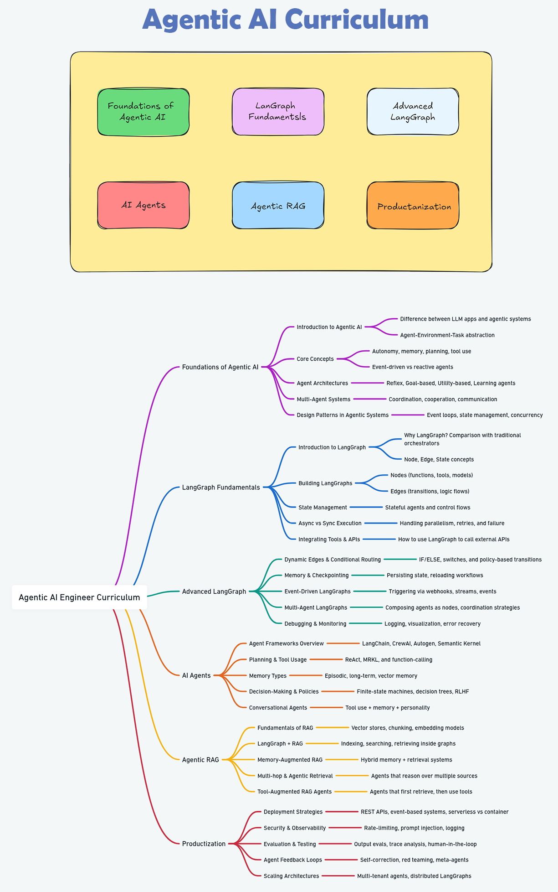

# 🤖 AgenticAI using LangGraph & MCP

<div align="center">


</div>


<div align="center">
  
</div>


## 📚 Table of Contents

- [🤖 AgenticAI using LangGraph \& MCP](#-agenticai-using-langgraph--mcp)
  - [📚 Table of Contents](#-table-of-contents)
  - [🧬 What is AgenticAI?](#-what-is-agenticai)
    - [🛠️ Core Components](#️-core-components)
      - [1. **Agents**](#1-agents)
      - [2. **LangGraph State Machine**](#2-langgraph-state-machine)
      - [3. **MCP Message Layer**](#3-mcp-message-layer)
      - [4. **Memory and Context Store**](#4-memory-and-context-store)
      - [5. **Tools and Interfaces**](#5-tools-and-interfaces)
      - [6. **Task Router / Controller**](#6-task-router--controller)
      - [7. **Observability \& Debugging**](#7-observability--debugging)
    - [🧠 GenAI vs AgenticAI](#-genai-vs-agenticai)
  - [📍 Agentic AI Curriculum](#-agentic-ai-curriculum)
  - [⚙️ Installation](#️-installation)
  - [Contributing](#contributing)
  - [⚖ ➤ License](#--license)
  - [❤️ Support](#️-support)
  - [🪙Credits and Inspiration](#credits-and-inspiration)
  - [🔗Connect with me](#connect-with-me)


---

<div align="center">
  
</div>


---

## 🧬 What is AgenticAI?

AgenticAI describes systems where:

- **Autonomy**: Agents independently plan and execute subtasks  
- **Orchestration**: Workflows are coordinated via a shared protocol (MCP)  
- **Composability**: Agents and graphs are modular, reusable, and testable  

These systems extend beyond classic Generative AI by providing **stateful**, **goal-oriented** workflows across multiple collaborative agents.


### 🛠️ Core Components

The Agentic AI system using **LangGraph** and the **Model Context Protocol (MCP)** is built around the following modular and interoperable components:

#### 1. **Agents**

- **Description:** Autonomous entities with specific roles, memory, tools, and objectives.
- **Examples:**

  - `PlannerAgent`: Decomposes high-level goals into actionable tasks.
  - `ResearchAgent`: Gathers relevant data or insights using tools like web search or RAG.
  - `ExecutionAgent`: Executes low-level tasks and invokes tools or APIs.
- **Features:** Stateful (via memory), tool-using, communicative (MCP-compliant messaging).

#### 2. **LangGraph State Machine**

- **Description:** The central orchestrator defining agent transitions, execution flow, and dynamic task routing.
- **Features:**

  - **Stateful DAG**: Nodes = agents/tools; Edges = routing logic.
  - **Conditional Routing**: Based on task output or system state.
  - **Concurrency & Retry Logic**: Supports parallel execution and fault tolerance.

#### 3. **MCP Message Layer**

- **Description:** Protocol for structured message exchange between agents.
- **Features:**

  - `Message`, `Thread`, `Step`, and `Run` objects.
  - Agent reasoning traceability.
  - Shared memory via `Thread` context.

#### 4. **Memory and Context Store**

- **Description:** Long- and short-term memory stores for agents.
- **Types:**

  - **Thread-level Memory**: Conversation history, decisions, intermediate steps.
  - **Agent Memory**: Role-specific memory for internal context and learning.
  - **External Vector DB** (e.g., FAISS, Weaviate): For RAG and semantic retrieval.

#### 5. **Tools and Interfaces**

- **Description:** External capabilities invoked by agents to augment reasoning.
- **Examples:**

  - Web search, code interpreter, database access, API clients.
- **Integration:** Tools are abstracted as callable nodes or plugins within LangGraph.

#### 6. **Task Router / Controller**

- **Description:** A centralized or decentralized mechanism to assign subtasks to agents.
- **Modes:**

  - **Centralized Planning:** Planner decides the full task flow.
  - **Distributed Negotiation:** Agents communicate and reassign tasks dynamically.

#### 7. **Observability & Debugging**

- **Description:** Logging, tracing, and monitoring components to track agent behavior and graph execution.
- **Tools:** LangGraph visualizer, logging middleware, state inspection.


### 🧠 GenAI vs AgenticAI

| Feature                    | Generative AI (GenAI)                                                    | Agentic AI                                                                 |
|----------------------------|---------------------------------------------------------------------------|-----------------------------------------------------------------------------|
| **Primary Output**         | Unstructured content (text, image, audio, video)                         | Structured outputs from autonomous task execution                         |
| **Execution Flow**         | Stateless, single-step inference per prompt                             | Stateful, iterative multi-step reasoning with memory                      |
| **Architecture**           | Monolithic or linear prompt pipelines                                    | Modular, event-driven multi-agent systems (e.g., DAGs in LangGraph)       |
| **Decision-Making Paradigm**| Prompt-conditioned output generation                                     | Goal-oriented planning with long-term memory and dynamic context tracking |
| **Autonomy**               | Passive response to human queries                                       | Proactive decision-making and self-directed task execution                |
| **Control Flow Logic**     | Determined by prompt engineering                                        | Driven by finite-state machines, graphs, or reactive policies             |
| **Memory & State Handling**| Typically ephemeral (no memory or limited through hacks like RAG)       | Persistent, structured memory for state tracking and dependency handling  |
| **Interactivity Level**    | Low—requires repeated user input                                        | High—agents plan, recover from failure, and reattempt subtasks            |
| **Tool Use & API Calling** | Manually scripted via code or prompt templates                          | Dynamically selected tools via agent/tool registries and MCP mechanisms   |
| **Adaptability**           | Fixed behavior per prompt configuration                                 | Context-aware adaptation based on task state and environment              |
| **Scalability**            | Scaling limited by model size and prompt length                         | Scales horizontally by orchestrating multiple specialized agents          |
| **Debuggability**          | Opaque reasoning; difficult to trace                                    | Transparent workflows; traceable node-level decisions                     |
| **Learning/Training**      | Pretrained foundation models; static behavior                           | Potential for online learning, fine-tuning per agent                      |
| **Security/Guardrails**    | Prompt filtering, static constraints                                    | Embedded policies, role-based access, task-level validation               |
| **Deployment Targets**     | Front-end apps, content generators, creative tools                      | Backend automation, orchestration layers, autonomous agent systems        |
| **Example Systems**        | ChatGPT, Claude, Gemini, DALL·E 3, Sora, MusicLM, MidJourney             | AutoGPT, LangGraph + MCP, OpenDevin, OpenAgents, CrewAI, MetaAgent, Devika |


---

## 📍 Agentic AI Curriculum

<div align="center">
  
</div>

## ⚙️ Installation

```bash
# 1. Clone the repo
git clone https://github.com/mohd-faizy/Agentic_AI_using_LangGraph_-_MCP.git
cd Agentic_AI_using_LangGraph_-_MCP

# 2. Create & activate a virtual environment
python -m venv venv
uv venv
# Unix/macOS
source venv/bin/activate
# Windows
venv\Scripts\activate

# 3. Install dependencies
pip install -r requirements.txt
uv add -r requirements.txt

```


## Contributing

1. Fork the repository
2. Create your feature branch (`git checkout -b feature/AmazingFeature`)
3. Commit your changes (`git commit -m 'Add some AmazingFeature'`)
4. Push to the branch (`git push origin feature/AmazingFeature`)
5. Open a Pull Request

## ⚖ ➤ License

This project is licensed under the **MIT License**. See the [LICENSE](LICENSE) file for details.  

## ❤️ Support

If you find this repository helpful, show your support by starring it! For questions or feedback, reach out on [Twitter(`X`)](https://twitter.com/F4izy).

## 🪙Credits and Inspiration

This repository draws inspiration from the exceptional educational content developed by Nitish, Krish Naik, and the DataCamp course `Developing LLMs with LangChain`. The implementations and examples provided here are grounded in their comprehensive tutorials on Generative AI, with a particular focus on LangChain and Hugging Face.

## 🔗Connect with me

➤ If you have questions or feedback, feel free to reach out!!!

[][twitter]
[][linkedin]
[][Portfolio]

[twitter]: https://twitter.com/F4izy
[linkedin]: https://www.linkedin.com/in/mohd-faizy/
[Portfolio]: https://ai.stackexchange.com/users/36737/faizy?tab=profile

---


```mermaid
graph TD
    A[🚀 Start with this Repo] --> B{Choose Learning Focus}

    B -->|LangGraph First| C[📊 Learn LangGraph Basics]
    C --> D[⚙️ Build State Machines]
    D --> E[🤖 Add Agents with Memory & Tools]
    E --> F[🌐 Integrate MCP Messaging]
    F --> G[🧠 Build Agentic AI Workflows]

    B -->|MCP First| H[🔌 Understand MCP Protocol]
    H --> I[💬 Message Passing & Context]
    I --> J[📡 Connect Agents via MCP]
    J --> G

    B -->|Full Agentic Path| K[🧬 Combine LangGraph + MCP]
    K --> L[🛠️ Add External Tools (Web, APIs, DBs)]
    L --> G

    G --> M[📍 Explore Agentic AI Curriculum]
    M --> N[🪙 Contribute & Extend Repo]
    N --> O[🌟 Become Agentic AI Expert]
```
